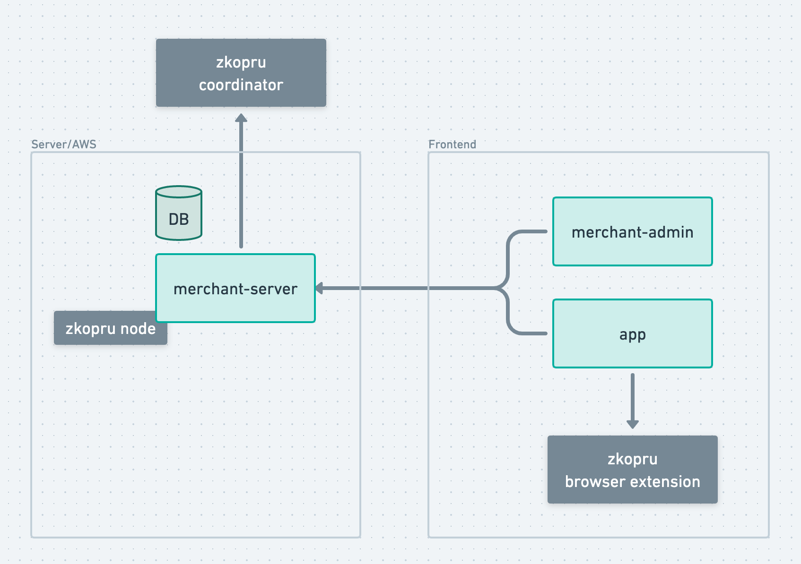

# Zkopru Merchant Service Architecture

## Components

- **merchant-server** - Server hosting the API responsible for managing products, inventory and orders. Connects to a SQL database.

- **merchant-admin** - UI app for managing products and inventory. Connects to merchant-server API

- **app** - Customer facing app for viewing products and placing orders. Connects to the Zkopru browser extension for creating transactions.

 

[Low Level Design](./low-level-design)